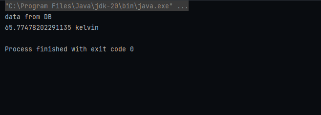

<h2 style="text-align:center;background:#fff;color:red;border-radius:10px">Injection des dépendances avec Spring IOC - XML et Annotations</h2>
<h3  style="text-align:center;background:#fff;color:red;width:50%;margin:auto;padding:5px;border-radius:10px">resultats avec Spring XML et Annotations</h3>

